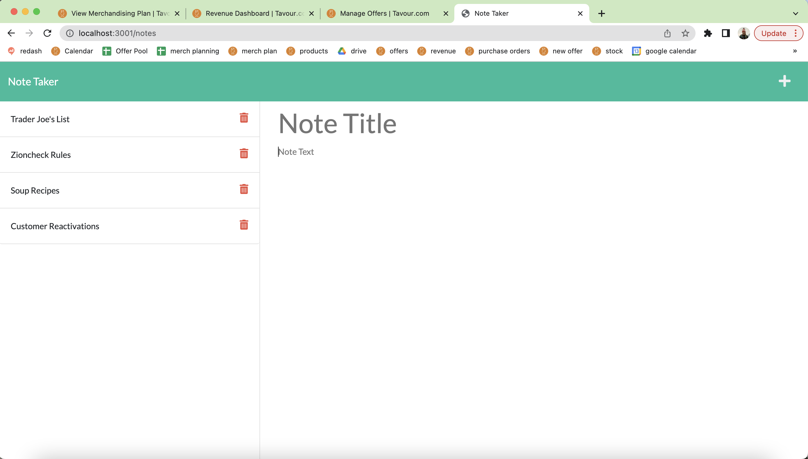
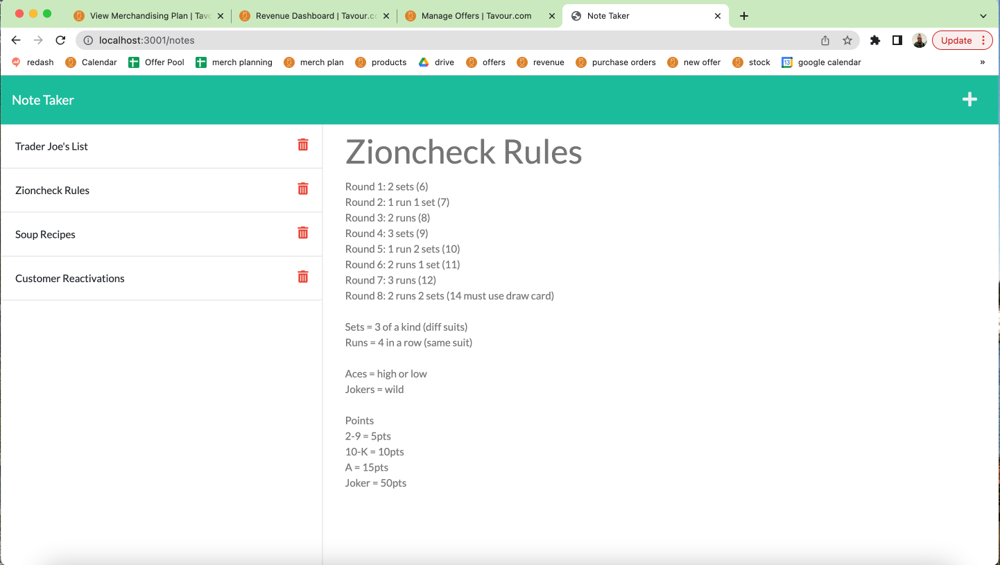

# note-taker

## Table of Contents

- [Link-To-Website](#link-to-website)
- [Description](#description)
- [Installation](#installation)
- [Screenshots](#screenshots)
- [License](#license)
- [Contributing](#contributing)
- [Tests](#tests)
- [Questions](#questions)

## Link To Website

[Link](https://sylvias-note-taker.herokuapp.com/)

## Description

This application, with the main user being a small business owner, provides an easy way for users to write and save notes. It makes organizing thoughts and keeping track of to-dos extremely easy so they can spend time focusing on more pressing issues. Users even have the ability to delete their notes so when the task has been accomplished, they don't have to see it anymore. Basically this app does wonders for users' productivity

## Installation

Clone the GitHub repository (git@github.com:sely1724/note-taker.git). Go to your integrated terminal and run using the command “node index.js”.

Once cloned, run these steps in your terminal.

1. npm init
2. npm i express

Then to run the program enter node server.js into the command line.

## Screenshots

## License

License used for this project: [MIT LICENSE](https://opensource.org/licenses/MIT)
Please refer to the license section of my REPO if additional information is needed

## Contributing

n/a

## Testing

n/a

## Questions

Questions? Feel free to get in touch:

GitHub: https://github.com/sely1724

Email: sylvianne9417@gmail.com
